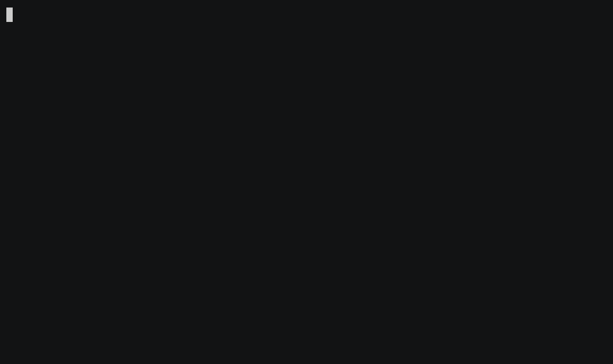
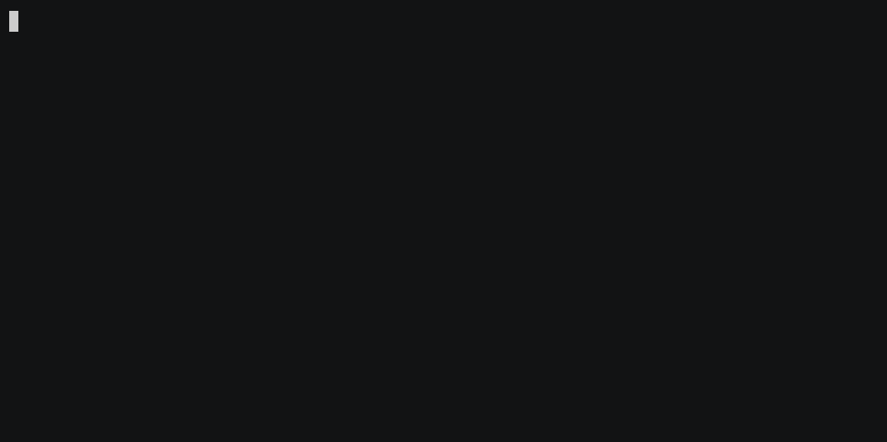

# TermStash

**Your Claude Code sessions expire. Keep the important ones.**

Find, resume and safely archive Claude Code sessions.
Local-first. Open source. No account.


Those two marked ⚠ are gone within days unless something keeps a copy. That is what this does.

**See what you have already lost** — it reads, it writes nothing:

```
$ npx termstash doctor

  At least 1876 sessions are no longer resumable.
  Their transcripts are gone; only the prompts survive in Claude's history.

  48 more are approaching Claude's retention cutoff.
  None of them is archived.

  termstash list --at-risk    see which ones
  termstash pin --at-risk     keep all of them
```

That output is from the machine this was built on. Yours will have its own numbers.

> **Status:** 0.1.0. macOS and Linux, Claude Code 2.1.269 to 2.1.289, CI on Node 20 and 22.
> Every number in this file is a measurement taken on 2026-10-04.

---

## Why

Claude Code keeps session transcripts on your machine for 30 days by default, then deletes
them. The retention clock runs on each transcript's last-modified time, so a session you
stop touching quietly disappears a month later.

On the machine this was built against, it had already happened to **at least 1,876 sessions**.
Their prompts still existed in Claude's own history file, which the sweep does not touch — but
the transcripts needed to resume them were gone, and nothing had ever said so. *At least*,
because the count includes only records Claude tagged with a session id; the rest cannot be
attributed and are reported separately.

### Why not just raise `cleanupPeriodDays`?

Do raise it — it helps. It is not a guarantee, and Claude Code's own issue tracker says so:

- [#41458](https://github.com/anthropics/claude-code/issues/41458) — `cleanupPeriodDays: 99999`,
  verified in a dotfiles backup every hour since January, and 490 sessions deleted anyway.
- [#59248](https://github.com/anthropics/claude-code/issues/59248) and
  [#90371](https://github.com/anthropics/claude-code/issues/90371) — sessions younger than the
  documented 30 days missing.

A setting decides when Claude deletes. A copy outside the directory Claude manages is the only
thing that decides whether the conversation survives it.

## Install

Node 20.11 or newer.

```bash
npm install -g termstash
termstash list
```

`list`, `search` and `doctor` only read what is already on your machine. Nothing is written
until you `pin`, `unpin`, `archive`, `restore`, `rename` or install the hook.

From source:

```bash
git clone https://github.com/kbuksakowski/termstash.git
cd termstash && npm install && npm run build && npm link
```

## What it does

`list` shows every session on the machine, including the ones Claude's own picker hides:
`claude -p` and SDK sessions, background sessions, and sessions outside the current worktree.

Its first column carries two independent facts — whether you protected it, and what
is happening to it:

```
★  pinned and actually protected by a current archive
☆  pinned but NOT protected - the archive fell behind, there is none,
   or there is one TermStash cannot read
●  open in another Claude process
▪  Claude has swept the transcript; the archive is the only copy left
⚠  approaching Claude's retention cutoff
?  retention cannot be determined, so no deadline is claimed
```

`list` decides "current" from size and modification time, because checksumming every archive
on every listing would make the command unusable. One state slips through that: same length,
same timestamp, different bytes — which restoring a backup over a transcript can produce.
`termstash doctor` is the command that actually compares the two and will tell you.

## What a pin buys you

Claude deletes a transcript and the conversation is gone — unless TermStash has a verified
copy. `restore` puts it back where Claude looks for it, and `resume` picks the conversation up
where it stopped:



The `rm` in that recording stands in for Claude's 30-day sweep — it does exactly what Claude
would do a month later. The archive exists because of the `pin` on the first line. A session
you never pinned is not recoverable; `search` will still find its prompts and say so plainly.

## Sessions Claude has already deleted

`search` also looks through Claude's prompt history, which is **not** subject to the retention
sweep and therefore outlives the transcripts it refers to. A query can turn up work whose
conversation is long gone:



An archived session is listed separately as `ARCHIVED — RESTORABLE`, with the command to bring
it back. `doctor` reports the total the same way — as a floor, never a count:

```
$ termstash doctor --details
· at least 1876 session(s) existed and are no longer resumable — their prompts
  survive in Claude's history, their transcripts do not
      most recent: 2026-09-16  /Users/you/work/api-gateway
      oldest:      2025-10-31  /Users/you/work/old-prototype
      842 older history record(s) carry no session id and were not counted
      termstash search <query> looks through these too
```

Records predating Claude's `sessionId` field cannot be attributed to a session, so they are
counted separately rather than grouped into sessions that may never have existed.

## Naming sessions from outside

Claude titles a session after its first prompt, so any session that opened with a slash command
is called `/commit`. On a working machine that is easily half the list:

```
9d16d9  platform-infra  /commit
809b1c  platform-infra  /commit
e63aac  web-client      /commit
```

Claude's own `/rename` fixes one, but only from inside that session — which is the wrong place,
since the moment you want to name a session is while you are staring at a list wondering which
is which. `termstash rename` does it from the list, and the new title is searchable:

```
$ termstash rename d5e5f2 "Payout reconciliation"
✓ d5e5f2 renamed
  was: PayoutReconciliationBatchProcessorService refactor
  now: Payout reconciliation

  This title is TermStash's own. Claude's session picker still shows its
  own title — use /rename inside the session to change that too.
```

Nothing is written into Claude's transcript, which is why the tool says so every time rather
than letting you discover it later.

## Keeping pins current by themselves

A pinned session's archive falls behind the moment you work in that session again, which
`list` shows as a hollow star. `termstash hook install` wires two hooks into Claude's settings
so the archive keeps itself current:

| Hook | Fires | Why both |
| --- | --- | --- |
| `Stop` | after every assistant turn | survives a killed terminal or a crash — `SessionEnd` does not |
| `SessionEnd` | on a clean exit | catches the final turn |

The hook does nothing at all unless the session is pinned and the transcript has actually
changed. When it does run it makes a full verified copy, so the cost grows with the transcript
rather than with what you just typed. Measured per invocation on an idle machine:

| transcript | 1 MB | 10 MB | 50 MB | 200 MB |
| --- | --- | --- | --- | --- |
| nothing changed | 0.05 s | 0.05 s | 0.05 s | 0.05 s |
| the turn just appended | 0.05 s | 0.2 s | 0.7 s | 2.2 s |

The second row is the one that matters: the turn that fires the hook is the turn that appended.
The first is genuinely free — it never opens the transcript. Under CPU *and* disk contention the
second row roughly doubles; CPU load alone barely moves it.

Nothing here approaches Claude's 60-second hook timeout; at this rate that is gigabytes away.
What you are choosing is how long you are willing to wait after a reply. Below 10 MB you will
not notice. At 50 MB it is about two thirds of a second, every turn. If you pin something much
larger than that, prefer refreshing it yourself with `termstash pin <id>` over installing the
hook.

```
☆●  30ecb4  TermStash  just now  …     ← archive is behind
                                        (Claude session ends)
★●  30ecb4  TermStash  just now  …     ← refreshed automatically
```

It touches only sessions you have pinned, writes nothing to your terminal, and never fails a
turn or an exit. The install is additive: it reads `settings.json`, leaves everything it does not
recognise alone, refuses to rewrite a file it cannot parse, and removes only its own entry.

## Doctor

`doctor` sorts everything it reports into three classes:

```
⚠  confirmed      the filesystem says so
?  potential      TermStash noticed something it cannot prove is wrong
·  informational  neither - a fact you may want to act on
```

It exits non-zero only on a confirmed finding.

## Commands

```bash
termstash list                      # every session on the machine, newest first
termstash list --at-risk            # only sessions approaching the retention cutoff
termstash search stripe             # titles, projects, prompts and replies
termstash resume 7f31a2             # resume by short id, in the right project
termstash pin 7f31a2                # mark important + keep a verified archive
termstash pin --at-risk             # the same, for every session near the cutoff
termstash archive 7f31a2            # a one-off copy, without marking the session
termstash restore 7f31a2            # bring an archived session back, duplicate-safe
termstash rename 7f31a2 "Stripe webhook"   # a title you'll recognise
termstash doctor                    # what is at risk, broken or orphaned
termstash hook install              # keep pinned sessions archived automatically
```

Ids are short — six characters is usually enough, and an ambiguous one is refused rather
than guessed. `--json` works on `list`, `search` and `doctor`. `termstash --help` has the
rest: filters, `--cwd`, `--replace`, `--details` and `unpin`.

## From inside Claude Code

Claude can manage its own session. Claude Code puts the current session's id in the
environment of every command it runs, as `CLAUDE_CODE_SESSION_ID` (verified on 2.1.289):

```bash
termstash pin "$CLAUDE_CODE_SESSION_ID"                       # keep this conversation
termstash rename "$CLAUDE_CODE_SESSION_ID" "Payout reconciliation"
termstash list --json                                         # everything, for a program
```

Exit codes can be relied on: 0 when a command did what it says, 1 when it refused or failed —
and for `doctor`, 1 means a confirmed finding. No command ever stops to ask a question. `resume` is the one exception by nature: it hands a terminal to Claude, so run from
inside an agent it refuses and prints the command for a person to run instead.

## Where TermStash keeps its own state

```
~/.termstash/
├── archive/<session-id>/{transcript.jsonl,manifest.json}
└── quarantine/<session-id>/<timestamp>/   # anything displaced rather than deleted
```

A previous archive is removed only when the new copy provably contains it, checked against the
recorded checksum rather than against its length. When it does not — a compacted session, a
truncated transcript, an archive TermStash can no longer read — the old one is moved into
`quarantine/`, which is never pruned. `TERMSTASH_HOME` relocates all of it.

## Security

> **Claude Code session transcripts are plaintext files and may contain secrets.**

Anything that passes through a tool is written to the transcript on disk: file contents,
command output, environment variables, API keys. Claude Code does not encrypt them; operating
system file permissions are the only protection.

Consequences for TermStash:

- archives and quarantine are created `0700` / `0600`, private to your user account,
- search output truncates transcript snippets rather than dumping raw content,
- nothing is uploaded anywhere — no network access is required, and there is no telemetry,
- fixtures committed to this repository are synthetic and pass an automated leak check; real
  transcripts are never committed.

## Compatibility

Verified against Claude Code 2.1.269 and 2.1.289, with recorded fixtures in `test/fixtures/`.

```
macOS     supported
Linux     supported
Windows   not supported yet
```

Every commit runs the unit suite and a 26-check lifecycle smoke test on macOS and Linux,
against Node 20 and 22. `resume` is the one path CI cannot cover — it hands off to the
`claude` binary, which the runners do not have — so it is verified by hand.

Claude Code's transcript format is internal and can change between releases. TermStash parses
defensively, reports an unrecognised format as a warning rather than failing, and is tested
against recorded fixtures per Claude Code version.

`npm test` runs the suite. Tests never touch your real `~/.claude`: they point
`CLAUDE_CONFIG_DIR` at a throwaway directory and refuse to run if it ever resolves to the
real one.

## How it works

TermStash reads Claude Code's own storage and delegates execution back to Claude. It does not
reimplement conversations, and it does not modify Claude's transcripts.

Everything it relies on was verified experimentally rather than assumed — see
[`TECHNICAL-SPIKE.md`](TECHNICAL-SPIKE.md) for the filesystem layout, the record schemas, the
resume and cleanup behavior, and the eleven experiments that established them.

## Documentation

| Document | Purpose |
|---|---|
| [`TECHNICAL-SPIKE.md`](TECHNICAL-SPIKE.md) | How Claude Code stores sessions, and the experiments behind every claim made here |
| [`CONTRIBUTING.md`](CONTRIBUTING.md) | How to report a problem, what is out of scope, building from source |
| [`.github/SECURITY.md`](.github/SECURITY.md) | What TermStash reads and writes, and how to report something sensitive |
| [`CHANGELOG.md`](CHANGELOG.md) | What changed, per release |

## If it earns it

TermStash is findable only if the people using it say so, and the people who need it most are
the ones who do not yet know their sessions are disappearing.

[](https://github.com/kbuksakowski/termstash)

## Reporting a problem

Bugs and ideas: [issues](https://github.com/kbuksakowski/termstash/issues).

Anything that could expose someone's transcript content goes to **oss@kamilbuksakowski.dev**
instead of a public issue — see [`.github/SECURITY.md`](.github/SECURITY.md) for what counts
and what TermStash actually touches.

## Contributing

Issues are welcome; pull requests are not accepted. [`CONTRIBUTING.md`](CONTRIBUTING.md) says
why, and what makes an issue most useful.

## License

MIT — see [`LICENSE`](LICENSE).
